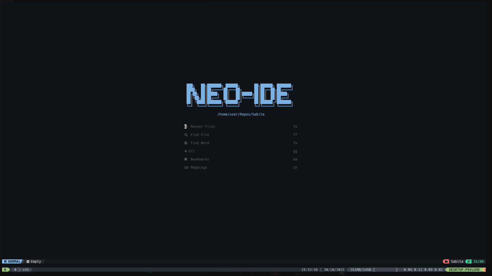

<h1 align="center">Neo-IDE</h1>

<div align="center">
  <i>A customized <a href="https://nvchad.com">NvChad</a> fork</i>
</div>


---

## Table of Contents

- [Install](#install)
- [CheatSheat](#cheatsheat)
  - [Commands](#commands)
    - [From plugins](#from-plugins)
    - [User defined](#user-defined)
  - [Mappings](#mappings)
- [Gallery](#gallery)

---

## Install

1. [NeoVim nightly](https://github.com/neovim/neovim/blob/master/BUILD.md#quick-start)

> Required version 0.11.4

```sh
cd $HOME/Repos
git clone https://github.com/neovim/neovim
cd neovim
make CMAKE_INSTALL_PREFIX=$HOME/Repos/neovim # If already builded run 'make distclean'
make install
sudo -s make install
```

2. [LazyGit](https://github.com/jesseduffield/lazygit)

[Install](https://github.com/jesseduffield/lazygit?tab=readme-ov-file#binary-releases)

3. Import Neo-IDE config

```sh
# Remove previously configured nvim folders
rm -rf ~/.cache/nvim
rm -rf ~/.local/share/nvim

git clone https://github.com/MikyStar/Neo-IDE ~/.config/nvim/
```

4. Install LSP with Mason

```sh
# Open nvim and run
:MasonInstallAll
```

## CheatSheat

### Commands

#### From plugins

- `:Lazy`: Open plugin manager
- `:Mason`: Open LSP manager
- `:Glow`: Markdown preview
- `:Outline`: Show code outline

#### User defined

_See lua/commands.lua_

- `:CloseBuffers`: Close all buffers
- `:CloseQuickfixes`: Close quickfix list
- `:CloseOtherBuffers`: Close all buffers except current one

### Mappings

_Here are only listed a few important ones, for more see lua/mappings.lua_

- `<leader>ch`: Show cheatsheat

- `<leader><leader>s`: Hop search
- `<leader><leader>w`: Hop word

- `<leader>gg`: LazyGit _(q to exit)_
- `<leader>oo`: Toggle outline
- `<leader>ww`: Pick window

- `<leader>la`: LSP code action
- `<leader>lb`: Format doc
- `K`: LSP hover

- `<leader>su`: Undo history
- `<leader>sn`: Open notifcations

- `(in NvimTree) g?`: Help on NvimTree

## Gallery



<div align="center">
  <i>Splashscreen</i>
</div>

---


<div align="center">
  <i>Splitted view and file explorer</i>
</div>

---


<div align="center">
  <i>Hop and Outline</i>
</div>

---


<div align="center">
  <i>LazyGit</i>
</div>

---


<div align="center">
  <i>Telescope</i>
</div>

---


<div align="center">
  <i>Snacks</i>
</div>
